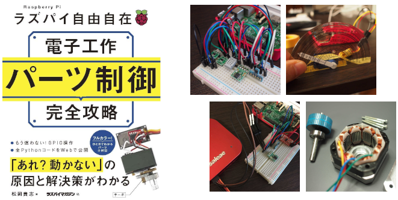

# raspi_parts_kouryaku

「ラズパイ自由自在 電子工作パーツ制御完全攻略」のサポートサイトです。



## Pythonコード

書籍内に記載されているPythonコードは、下記の一括ダウンロードをクリックするとZIPファイルでダウンロードできます。  
チラっと見たいだけであれば、各章のリンクをクリックしてください。GitHub上の該当ディレクトリが開きます。

**[一括ダウンロード（ZIPファイル）](https://github.com/matsujirushi/raspi_parts_kouryaku/archive/refs/heads/master.zip)**

**GitHub上で参照:**

* パーツ分解・実験編
  * [1章 多様なLEDを光らす](python/01)
  * [2章 5種の温度センサーを比較](python/02)
  * [3章 条件を変えて距離センサーの精度を調査](python/03)
  * [4章 重さを量るロードセルとロードセンサーは高精度](python/04)
  * [5章 音を取り込むマイクで多様な録音を試す](python/05)
  * [6章 可変抵抗器などで設定値を微調整](python/06)
  * [7章 サーボモーターの制御をソフトで補正](python/07)
  * [8章 ステッピングモーターをきめ細かく制御](python/08)
  * [9章 安価で小型のキャラクターディスプレイ](python/09)
  * [10章 グラフィックスディスプレイと電子ペーパーの内部構造](python/10)
* Raspberry PiのIO詳解編
  * [11章 デジタル入力](python/11)
  * [12章 デジタル出力](python/12)
  * [13章 PWM出力](python/13)
  * [14章 I2C(SMBus編)](python/14)
  * [15章 I2C(汎用編)](python/15)
  * [16章 SPI](python/16)
  * [17章 UART](python/17)

## 訂正情報

|ページ|訂正|補足説明|
|:--|:--|:--|

## 質問・フィードバック

書籍に関する質問やフィードバックはGitHubの[Issues](https://github.com/matsujirushi/raspi_parts_kouryaku/issues)とEメールで受け付けています。  
Eメールは取りこぼす可能性大なので、できるだけIssuesでご連絡をお願いします。

**Issueの場合:**

1. 画面上部にあるをクリック。
2. 画面右側にあるボタンをクリック。
3. `Title`欄にタイトル、`Leave a comment`欄に伝えたい内容を記入して、をクリック。

**Eメールの場合:**

下記事項をへ送ってください。

* タイトルに**ラズパイパーツ制御本**を含めてください。
* 本文に、**章**、**ページ番号**、**内容**を記入してください。

基本的には、GitHubのIssueに転記して回答します。Eメールの返答では回答いたしませんのでご了承ください。

## ライセンス

本サイトに掲載されているドキュメント、Pythonコードなどは、特別な記載が無い限り[Apache License, Version 2.0](LICENSE.txt)です。

```
   Copyright 2022 matsujirushi

   Licensed under the Apache License, Version 2.0 (the "License");
   you may not use this file except in compliance with the License.
   You may obtain a copy of the License at

       http://www.apache.org/licenses/LICENSE-2.0

   Unless required by applicable law or agreed to in writing, software
   distributed under the License is distributed on an "AS IS" BASIS,
   WITHOUT WARRANTIES OR CONDITIONS OF ANY KIND, either express or implied.
   See the License for the specific language governing permissions and
   limitations under the License.
```